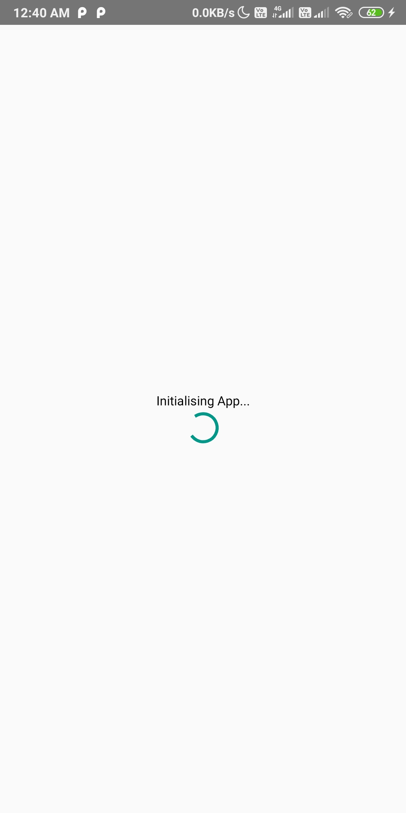
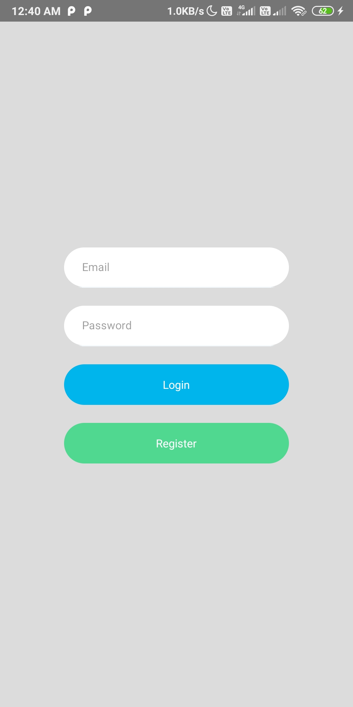
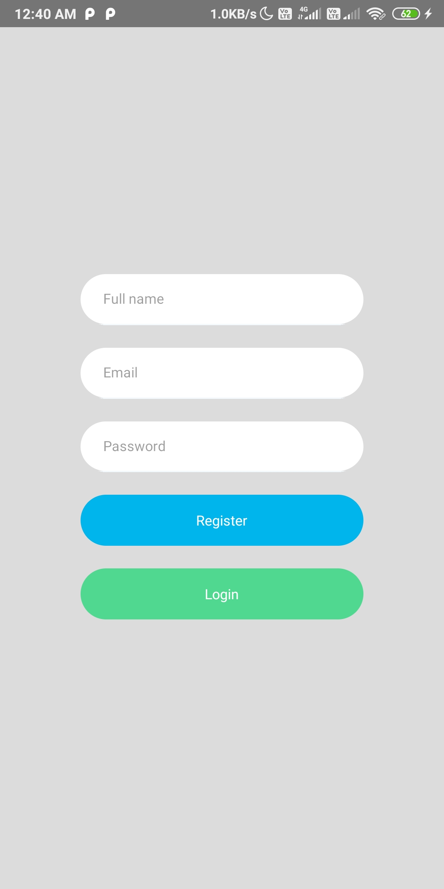
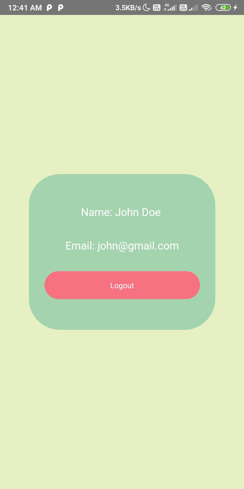

## Setup

### Tools

1. Download and install Android Studio and Java SDK (version 8).
2. Setup the JAVA_HOME environment variable in your .bashrc and run `source ~/.bashrc`

### Setting up adb

1. Install adb in your machine (`sudo apt-get install adb`)
2. Enable usb debugging in your android device and plug in usb.
3. Run `adb devices` and it should show your attached device.
4. Run `adb tcpip 5555` and unplug the device(pc and device should be connected over same network).
5. Navigate to settings > about phone > status > IP address.
6. Run `adb connect IP_ADDR:5555` and accept the permissions from your device.

### Running on device

1. Navigate to `android` folder and create a file `local.properties` that would contain the path to your android SDK. (ex - `sdk.dir=/home/sagar/Android/Sdk`)
2. For the first run `react-native run-android` and it should build apk in your device.
3. For next subsequent changes enable `hot reloading`.

## Screenshots

<table>
    <tr>
     <td><kbd></kbd></td>
     <td><kbd></kbd></td>
     <td><kbd></kbd></td>
     <td><kbd></kbd></td>
    </tr>
  </table>
